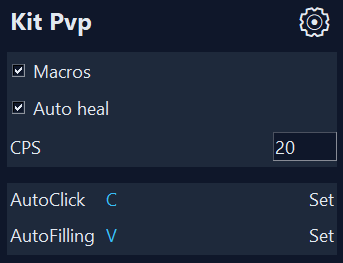
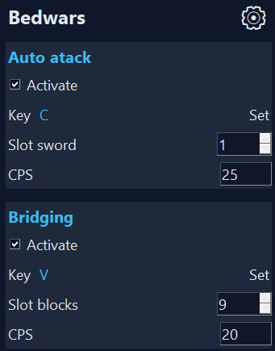

# 🗡️ Fighting PVP Bot

Тренируйся PvP умнее, а не сложнее.

---

## 🚀 О проекте

Fighting PvP Bot — это тренировочный инструмент для Minecraft PvP, который берет на себя часть механических действий, чтобы ты мог сосредоточиться на тактике, позиционке и принятии решений.

Бот не играет за тебя — он помогает учиться быстрее.

---

## 🖥️ Интерфейс

---

## 🎥 Демонстрация

---

## ✨ Что нового

- 🎨 Полностью обновлённый интерфейс (UI)
- ⚡ Улучшенная система управления настройками
- 🧩 Новая структура конфигурации
- 🛏️ Добавлен отдельный раздел BedWars

---

## 🛏️ BedWars режим

Теперь бот имеет отдельный функционал для BedWars:

### ⚔️ PvP помощь
- Автоматическая атака
- Настраиваемый CPS
- Быстрое переключение слотов

### 🌉 Bridge макросы
- Помощь в строительстве мостов
- Стабильные тайминги
- Управление через горячие клавиши

---

## ⚙️ Основные функции

### 🗡️ Kit PvP
- AutoClick
- AutoHeal (AutoFilling)
- Настройка CPS
- Горячие клавиши

### 🛏️ BedWars
- PvP макросы (авто атака)
- Bridge макросы (помощь в строительстве)
- Настраиваемые клавиши и CPS

### 🧠 Общие
- Гибкая конфигурация
- Переключение режимов (KitPvP / BedWars)
- Простой и удобный UI
- Поддержка дополнительных (вспомогательных) клавиш

---

## 🎮 Управление

Все настраивается прямо в интерфейсе:
- назначение клавиш
- включение/выключение функций
- выбор режима

💡 Ты можешь использовать удобные вспомогательные клавиши, например:
- боковую переднюю кнопку мыши — для авто удара
- боковую заднюю кнопку мыши — для AutoHeal или Bridge

Это позволяет максимально упростить управление и сосредоточиться на PvP.

---

## 📥 Установка

1. Скачай последнюю версию из раздела Releases [Скачать]([https://t.me/retroLabPvP](https://github.com/Retro-Man-Lab/Fighting_CV2_Bot_for_minecraft/releases/tag/v1.0.0))
2. Запусти файл
3. Настрой под себя

---

## ⚠️ Важно

Этот инструмент создан для тренировок и обучения.  
Используй его ответственно.

---

## 📢 Сообщество

Тренировки PvP с ботом, заходи — https://t.me/retroLabPvP

---

## 💡 Планы

- 🤖 Новые макросы
- 🎯 Улучшение стабильности
- ⚙️ Расширение BedWars функционала
- 🔥 Новые режимы тренировок

---

## Лицензия

MIT
